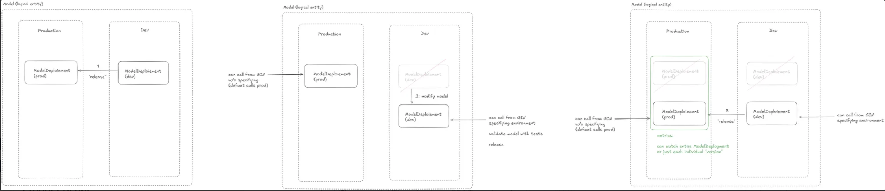

---

title: 'Dev and prod lifecycle'

description: 'TO DO.'

---

The development and production lifecycle is a critical process in software development that encompasses the journey from initial coding to final deployment and ongoing maintenance. This lifecycle includes key phases such as development, where new features are created and bugs are fixed; testing, which ensures software quality and functionality; staging, where final checks are performed in a production-like environment; and production, where the software goes live for end-users. Throughout this cycle, teams utilize version control, CI/CD pipelines, and automated testing to maintain code quality and streamline transitions between phases. Understanding and optimizing this lifecycle is crucial for organizations aiming to deliver high-quality software efficiently in today's fast-paced digital landscape.

## Managing Development and Production Lifecycle with Models on Beamlit

### Introduction

Managing the development and production lifecycle of models on Beamlit involves several key stages and concepts. This guide will walk you through the process of deploying, updating, and maintaining your models across different environments.

### Key Concepts

- **Models:** The base logical entity labeling an AI model throughout its lifecycle.
- **Deployments:** Instantiations of one model version over a specific environment.
- **Executions:** Ephemeral invocations of model deployments by consumers.
- **Environments:** Pre-configured settings that determine policies and deployment conditions.

### Deployment Lifecycle

### 1. Initial Deployment

To deploy a model on Beamlit:

1. Choose a model origin (file upload or HuggingFace)
2. Select an appropriate runtime
3. Choose the target environment
4. Set any additional policies
5. Use the Beamlit CLI command (example: `beamlit my-command TO COMPLETE`)

### 2. Updating Model Versions

As you iterate on your model:

1. Use the blue-green deployment paradigm
2. Update the model file, inference runtime, or policies
3. Use the CLI command: `beamlit my-command TO COMPLETE`
4. Alternatively, use the Beamlit console for updates

### 3. Releasing to Production

To move a model from development to production:

1. Use the "releasing" feature in Beamlit
2. Choose the origin (e.g., development) and destination (e.g., production) environments
3. Decide whether to release deployment-level policies
4. Use the CLI command: `beamlit my-command TO COMPLETE`

### 4. Deactivation and Reactivation

Manage active deployments:

1. Deactivate models to stop endpoint accessibility and resource consumption
2. Reactivate models as needed
3. Use the Beamlit console, API, or CLI for these operations

### Best Practices

- Utilize multiple environments for staged releases (e.g., development, staging, production)
- Regularly update and test models in lower environments before releasing to production
- Monitor deployment status through the console or CLI/APIs
- Be aware of environment-specific policies that may affect model behavior

### Advanced Features

### Cloud Burst Network

For on-premise deployments with overflow capacity:

- Set up minimal-footprint deployments using Cloud Burst Network
- Reference models deployed on private infrastructure
- Allow overflow to Beamlit during unexpected burst traffic

### Conclusion

Effectively managing the development and production lifecycle of models on Beamlit involves understanding the platform's concepts, utilizing its deployment features, and following best practices for updates and releases. By leveraging Beamlit's serverless and distributed architecture, you can efficiently manage your AI models from development to production.