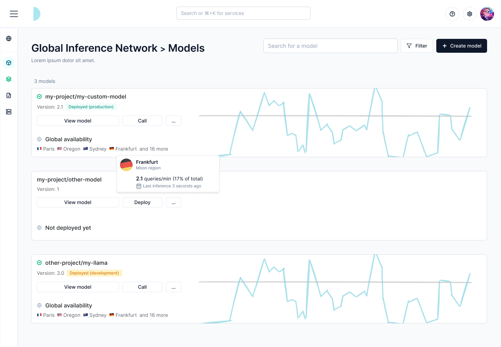
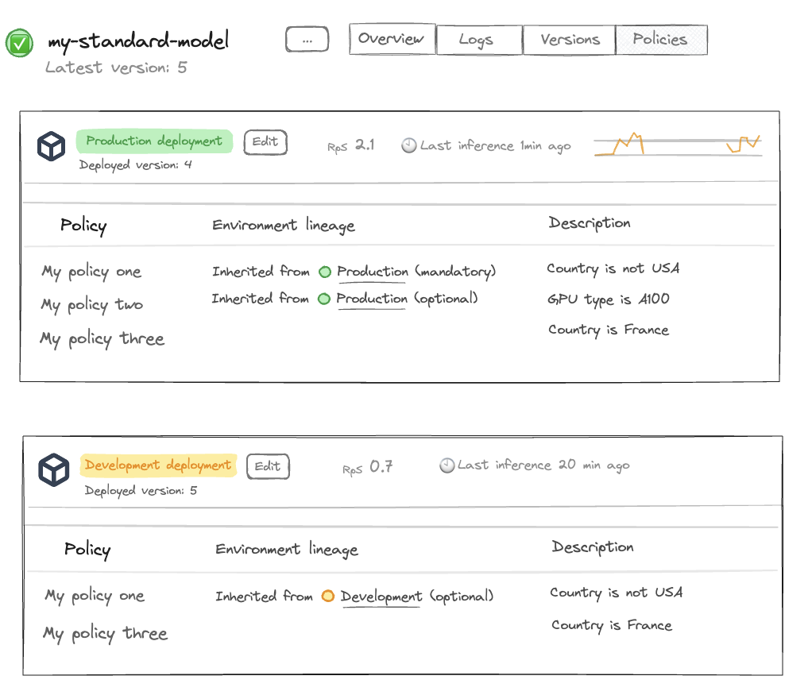

---

title: 'Model deployment'

description: 'Deploy AI models and manage the life-cycle of deployments in production.'

---

As a natively serverless and distributed serving infrastructure, Beamlit let you bring any model trained externally and serve them on Global Inference Network, whether they are public models, or private fine-tuned models. For each model deployment, an [inference endpoint](../Overview.md) is generated by Beamlit for consumers to invoke inference requests. 

Models can be deployed using either Beamlit’s APIs, CLI, console ; or using our Kubernetes operator.

## How model deployment works

### Introduction

Beamlit is a cloud-native infrastructure platform that is natively **serverless**. Any AI model or software pushed to Beamlit is ran in response to inference requests without requiring provisioning or management of serving/inference servers or hardware. It automatically scales compute resources and you pay only for the compute time used.

Beamlit is also natively **distributed.** By default, all workloads (such an AI model processing inference requests for example) run across multiple execution locations, that can span over multiple geographic areas or cloud providers, in order to optimize for ultra-low-latency or other strategies. This is accomplished by decoupling this execution layer from a data layer made of a smart distributed network that federates all those execution locations.

### Models and deployments

Beamlit works using two conceptual entities: **models** and **deployments**.

- **Models** are the base logical entity labeling an AI model throughout it’s life-cycle. A model can be instantiated into multiple deployments over different environments. This effectively allows to run multiple versions of the model at the same time, each on a different environment.
- **Deployments** (a.k.a model deployments) are the instantiation of one model version over one specific environment. For example, you can have a *deployment* of *model* ABC on the *production environment*.
- **Executions** (a.k.a inference executions) are ephemeral invocations of model deployments by a consumer. Because Beamlit is serverless, a model deployment is only materialized onto one of the execution locations when it actively receives and processes requests. Workload placement and request routing is fully managed by the Global Inference Network, as defined by your environment policies.

A model can be uploaded into Beamlit from a variety of origins. At this moment, it can be either: **just** **created** (a *model deployment* exists but it is deactivated), or **created and deployed** (as a *model deployment*). At any time, you can deactivate a model deployment, and update it with a new version.



## Deployment life-cycle

### Deploying a model

Deploying a model will create the associated model deployment and make it activated. At this time: 

- it is reachable through a specific endpoint
- it does not consume resources until it is actively being invoked and processing inferences
- its deployment/inference policies are governed by the associated environment
- its status can be monitored either on the console or using the CLI/APIs



Deploy the model by running the following command:

```
beamlit my-command TO COMPLETE
```

Models can also be deployed using the Beamlit console, API and the Beamlit Kubernetes operator.


### Updating a model version

As you iterate on software development, you will need to update the version of a model that is currently deployed and used by your consumers.

One way to manage this is through multiple environments, and releasing the model version that is on one environment (e.g. development) to another environment (e.g. production). Another more straightforward way is to directly update a model deployment on an environment.

When updating a model deployment, you can:

- update the underlying model file/origin
- update the inference runtime for the model
- update the policies directly attached to the model deployment

Model deployments are updated following a **blue-green** paradigm. The Global Inference Network will wait for the new version to be completely up and ready before routing inference requests to the new deployment.

Update the *development* deployment for a model by running the following command:

```
beamlit my-command TO COMPLETE
```

Models can also be updated using the Beamlit console (see below), API and the Beamlit Kubernetes operator. 

When using the Beamlit console, you can update all model configurations (model file, runtime, etc.) except policies by selecting ***Deploy a new version***.

[screen of update version in menu]

To update the policies of a model deployment using the Beamlit console, go the the ***Policies*** page and edit them here.

[screen update policies in menu]

### Releasing to another environment

Because you have several environments, you can manage deployment of a model version from one environment to the other. On Beamlit, this is called ***releasing*** a model deployment. 

When releasing, you need to choose an *origin* environment and a *destination* environment. Upon releasing:

1. the model deployment on the *destination* environment (if it exists) will be overwritten (i.e. updated) with the model deployment from the *origin* environment. This includes all configurations in the model deployment: the model file/origin and model runtime. 
    - You can choose whether to also release the [policies set at the level of the origin model deployment](Model-deployment.md) on the destination deployment. This will overwrite all deployment-level policies in the destination environment with the ones from the origin deployment.
    - ⚠️ Warning: if the environment-level policies are different between the origin and destination, the behavior of the deployment may be different between the two environments.
2. the model deployment on the *origin* environment will remain unchanged, and will still be reachable after release

> Learn more about managing a development/production life-cycle on Beamlit here.

Release a model deployment from the *development* environment to the *production* environment by running the following command:

```
beamlit my-command TO COMPLETE
```

Models can also be released using the Beamlit console, API and the Beamlit Kubernetes operator.

### Deactivating a model deployment

Any model deployment can be deactivated at any time. When deactivated, it will **no longer be reachable** through the inference endpoint and will stop consuming resources. 

Models can be deactivated and activated at any time from the Beamlit console, or via API or CLI.

[screen of deactivating]

## Deployment reference

### Model origins

Beamlit supports the following origins for models:

- **Uploading a file.** Use a static file containing the model. Uploading through the interface has a limit of 5GB, else you must use the CLI.
    - For the moment, Beamlit only support uploading Torch-based models. We are currently working on extending model support, please reach out if you need a specific model type.
    - Supported extensions: .MAR only
- **HuggingFace.** Beamlit will use your workspace integration to retrieve any model deployed on HuggingFace. For private models, it will only be able to retrieve models within the scope of allowed models for your HuggingFace token.

Read about the API parameters in the reference.

### Runtime

Beamlit suggests an optimized inference runtime for each model you attempt to deploy. You can override it by passing the Docker image for a custom inference runtime when deploying the model.

Beamlit natively supports the following runtimes:

- **Beamlit Transformers/Diffusers**: our optimized inference engine made for Transformers and Diffusers models
- **Beamlit Torch**: our optimized inference engine made for Torch-based models
- **TGI**
- **TEI**

### Environment

You must choose an environment when deploying a model on Beamlit. Environments allow you to pre-attach policies to a model deployment (for example: to make the model only available in certain countries). 

Upon choosing an environment, it will automatically attach all the environment’s policies on the model deployment. Environment policies that are mandatory cannot be edited, the others can be removed or replaced during the deployment of a specific model. TO UPDATE

Read about the API parameters in the reference.

### Policies

Additional policies can be attached to a model deployment directly. If there already are policies set in the environment, policies of the **same policy type** (e.g. location-based, gpu-based, etc.) will collide. In this case, the result will be as follows.

If the policy is set as ***mandatory*** in the environment, then the result for this policy type will be the **intersection** of the policy in the environment and policy in the deployment.

> For example, let’s say your *production* environment enforces a mandatory policy to run models within North America only, and while deploying a model on the production environment you also attach a policy to deploy the model in the United States, then the final model will only run in the United States.

If the policy is set as ***not* *mandatory*** in the environment, then the result for this policy type will be **overwritten** by the policy in the deployment. The environment policy **acts as a default** here.

> For example, let’s say your *production* environment enforces a non-mandatory policy to run models on NVIDIA T4 only, and while deploying a model on the production environment you also attach a policy to deploy the model on NVIDIA A100, then the final model will only run on A100s. 

> If you didn’t attach any policy directly in the model, the final model would only run on T4s.

Read about the API parameters in the reference.

## Deploy a replica of a on-prem model

Minimal-footprint deployments can be setup using Cloud Burst Network, by referencing a model deployed on your own private infrastructure (on-prem or cloud) and make it overflow on Beamlit only in case of unexpected burst traffic.

Read our guide for offloading your own model on a Beamlit replica.

## Examples

- Read our tutorial for deploying a public Llama model on Beamlit
- Read our tutorial for deploying a custom fine-tuned model from HuggingFace