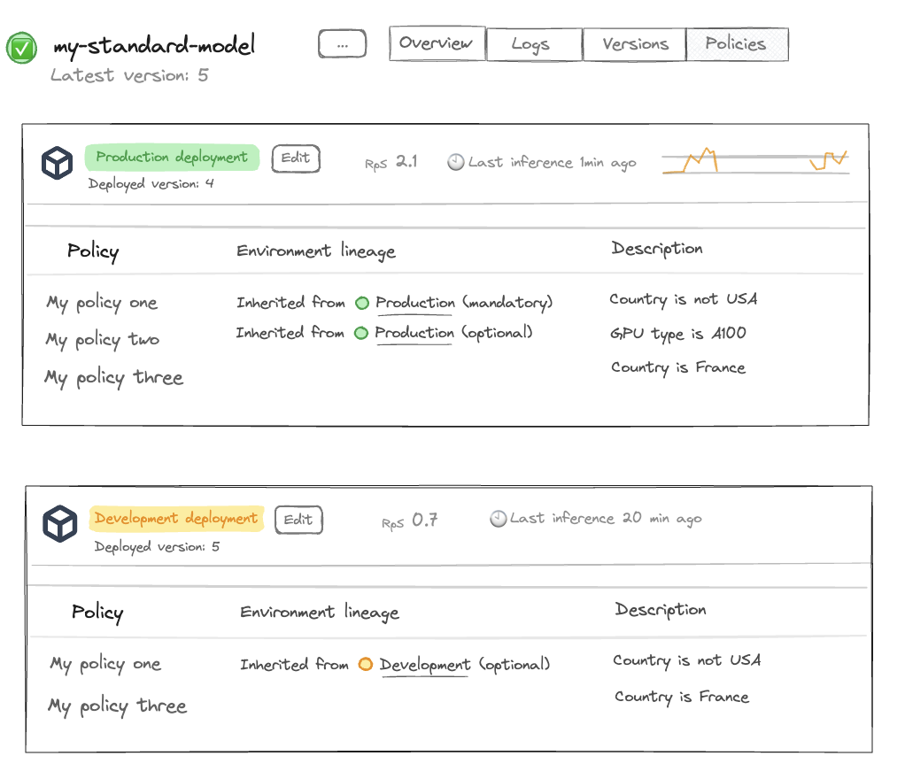

---

title: Model deployment

description: This is a super overview.

---

As a natively serverless and distributed serving infrastructure, Beamlit let you bring any model trained externally and serve them on Global Inference Network, whether they are public models, or private fine-tuned models. For each model deployment, an inference endpoint is generated by Beamlit for consumers to invoke inference requests. 

Models can be deployed using either Beamlit’s APIs, CLI, console ; or using our Kubernetes operator.

## How model deployment works

### Introduction

Beamlit is a cloud-native infrastructure platform that is natively **serverless**. Any AI model or software pushed to Beamlit is ran in response to inference requests without requiring provisioning or management of serving/inference servers or hardware. It automatically scales compute resources and you pay only for the compute time used.

Beamlit is also natively **distributed.** By default, all workloads (such an AI model processing inference requests for example) run across multiple execution regions, that can span over multiple geographic areas or cloud providers, in order to optimize for ultra-low-latency or other strategies. This is accomplished by decoupling this execution layer from a data layer made of a smart distributed network that federates all those execution regions.

### Models and deployments

Beamlit works using two conceptual entities: **models** and **deployments**.

- **Models** are the base logical entity labeling an AI model throughout it’s life-cycle. A model can be instantiated into multiple deployments over different environments. This effectively allows to run multiple versions of the model at the same time, each on a different environment.
- **Deployments** (a.k.a model deployments) are the instantiation of one model version over one specific environment. For example, you can have a *deployment* of *model* ABC on the *production environment*.
- **Executions** (a.k.a inference executions) are ephemeral invocations of model deployments by a consumer. Because Beamlit is serverless, a model deployment is only materialized onto one of the execution clusters when it actively receives and processes requests. Workload placement and request routing is fully managed by the Global Inference Network, as defined by your environment policies.

A model can be uploaded into Beamlit from a variety of origins. At this moment, it can be either: **just** **created** (a *model deployment* exists but it is deactivated), or **created and deployed** (as a *model deployment*). At any time, you can deactivate a model deployment, and update it with a new version.

A list of models on Beamlit console

## Deployment life-cycle

### Deploying a model

Deploying a model will create the associated model deployment and make it activated. At this time: 

- it is reachable through a specific endpoint
- it does not consume resources until it is actively being invoked and processing inferences
- its deployment/inference policies are governed by the associated environment
- its status can be monitored either on the console or using the CLI/APIs

A list of model deployments

Deploy the model by running the following command:

< TO COMPLETE > 

Models can also be deployed using the console, Beamlit API and the Beamlit Kubernetes operator.

### Updating a model version

As you iterate on software development, you will need to update the version of a model that is currently deployed and used by your consumers.

One way to manage this is through multiple environments, and releasing the model version that is on one environment (e.g. development) to another environment (e.g. production). Another more straightforward way is to directly update a model deployment on an environment.

When updating a model deployment, you can:

- update the underlying model file/origin
- update the policies directly attached to the model deployment

Model deployments are updated following a **blue-green** paradigm. The Global Inference Network will wait for the new version to be completely up and ready before routing inference requests to the new deployment.

Update the *development* deployment for a model by running the following command:

< TO COMPLETE > 

Models can also be updated using the console, Beamlit API and the Beamlit Kubernetes operator.

### Releasing to another environment

Because you have several environments, you can manage deployment of a model version from one environment to the other. On Beamlit, this is called ***releasing*** a model deployment. 

When releasing, you need to choose an *origin* environment and a *destination* environment. Upon releasing:

- the model deployment on the *destination* environment (if it exists) will be overwritten (i.e. updated) with the model deployment from the *origin* environment. This includes the model file, and XXX
- DOES IT RELEASE THE DEPLOYMENT-SPECIFIC POLICIES TOO?
- the model deployment on the *origin* environment will remain unchanged, and will still be reachable after release

> Learn more about managing a development/production life-cycle on Beamlit here.

Release a model deployment from the *development* environment to the *production* environment by running the following command:

< TO COMPLETE > 

Models can also be released using the console, Beamlit API and the Beamlit Kubernetes operator.

### Deactivating a model deployment

Any model deployment can be deactivated at any time. When deactivated, it will **no longer be reachable** through the inference endpoint and will stop consuming resources. 

Models can be deactivated and activated at any time from the Beamlit console, or via API or CLI.

[screen of deactivating]

## Deployment reference

### Model origins

Beamlit supports the following origins for models:

- **S3-compatible storage.** Beamlit will connect to the S3 bucket and filepath to retrieve the static model file.
- UPLOAD FILE? (.MAR only)
- **HuggingFace.** Beamlit will use your workspace integration to retrieve any model deployed on HuggingFace. For private models, it will only be able to retrieve models within the scope of allowed models for your HuggingFace token.

Read about the API parameters in the reference.

### Runtime

TO DO

### Environment

You must choose an environment when deploying a model on Beamlit. Environments allow you to pre-attach policies to a model deployment (for example: to make the model only available in certain countries). 

Upon choosing an environment, it will automatically attach all the environment’s policies on the model deployment. Environment policies that are mandatory cannot be edited, the others can be removed or replaced during the deployment of a specific model.

Read about the API parameters in the reference.

### Policies

Additional policies can be attached to a model deployment directly. If they collide with the policies set at the level of the environment, the environment policy will be enforced ultimately.

For example, let’s say your *production* environment enforces a mandatory policy to run models within the United States only, and while deploying a model on the production environment you also attach a policy to deploy the model in Australia, then the final model will only run in the United States. TO DOUBLE CONFIRM

Read about the API parameters in the reference.

## Deploy a replica of a on-prem model

Minimal-footprint deployments can be setup using Cloud Burst Network, by referencing a model deployed on your own private infrastructure (on-prem or cloud) and make it overflow on Beamlit only in case of unexpected burst traffic.

Read our guide for offloading your own model on a Beamlit replica.

## Examples

- Read our tutorial for deploying a public Llama model on Beamlit
- Read our tutorial for deploying a custom fine-tuned model from HuggingFace